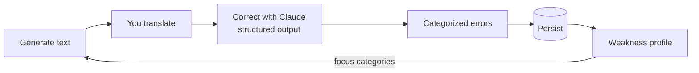

# WriteRight

> AI-powered writing practice: translate texts and get corrections that track your recurring mistakes to focus your studies.


WriteRight is a small app I built to practice writing in another language — and to actually use, not just demo. You translate a short generated text, an LLM corrects it and **classifies every mistake into a fixed taxonomy**, and those classifications pile up into a profile of your weaknesses that then **steers the next exercise** toward the categories you get wrong most.

It's a personal tool first (I use it to study English) and a portfolio piece second.

## The idea: an adaptive error loop

Most correction tools tell you what's wrong once and forget it. WriteRight remembers. The core is a closed loop — **error → category → profile → targeted generation**:



1. **Generate** a short text at your CEFR level, optionally themed.
2. **Translate** it yourself.
3. **Correct** — the model returns the fixed text plus every error, each tagged with a **category** and a **severity**, via structured output (a JSON schema, not free text).
4. **Persist** every categorized error.
5. **Profile** — aggregate errors by category to surface your top weaknesses.
6. **Target** — the next text is generated so that translating it naturally forces those weak categories to come up again.

The fixed taxonomy is what makes this work: stable categories mean the profile stays comparable over time, and the model is *required* to classify into them rather than inventing labels.

## The taxonomy (the core asset)

A **closed set of 19 categories** — deliberately fixed, because every new category fragments the historical data. Correction and severity are separate axes (severity: *breaks meaning* / *understandable* / *polish*), so you can study what actually blocks communication before the fine details.

| Group | Categories |
|---|---|
| **Structure / grammar** | SubjectOmission, VerbTense, VerbForm, Agreement, Article, Preposition, Pronoun, WordOrder, NumberCountability, MissingOrExtraWord |
| **Vocabulary / meaning** | WordChoice, FalseCognate, Collocation, LiteralTranslation |
| **Mechanics** | Spelling, Capitalization, Punctuation |
| **Style** | Naturalness |
| **Escape hatch** | Other (used only when nothing else fits — a high rate here means a category is missing) |

The taxonomy lives in one place (`WriteRight.Shared`) and is the single source of truth: the UI reads its friendly labels from it, and the JSON schema sent to the model derives its allowed values straight from the same enums — so the schema can never drift out of sync with the taxonomy.

## Tech stack

- **Backend:** ASP.NET Core minimal API (.NET 10, C#)
- **Frontend:** Blazor WebAssembly (standalone SPA)
- **Data:** EF Core + SQLite (enums persisted as strings; migratable to Postgres later)
- **AI:** Claude via the official Anthropic C# SDK, using **structured output**
- **Tests:** xUnit

Blazor earns its place here for one concrete reason: the API and the UI **share the same C# data contracts** (`WriteRight.Shared`), so there's no parallel TypeScript model to keep in sync.

The AI work is split by cost: a fast, cheap model **generates** exercises and a stronger model **corrects** them — both are configurable.

## Project structure

```
WriteRight.slnx
├── WriteRight.Shared/   # DTOs + the error taxonomy (shared by API and UI)
├── WriteRight.Api/      # Minimal API, EF Core/SQLite, Claude integration
├── WriteRight.Client/   # Blazor WebAssembly SPA
└── WriteRight.Tests/    # xUnit — covers the core (taxonomy, schema, persistence, aggregation)
```

## Running locally

**Prerequisites**

- [.NET 10 SDK](https://dotnet.microsoft.com/download)
- An **Anthropic API key** with pay-as-you-go credit ([console.anthropic.com](https://console.anthropic.com)) — this is billed separately from a Claude.ai subscription.

**Set the API key** (via user-secrets — never commit it):

```bash
dotnet user-secrets set "Llm:ApiKey" "sk-ant-..." --project WriteRight.Api
```

**Run the API and the client** in two terminals (both over HTTP, to avoid mixed-content):

```bash
dotnet run --project WriteRight.Api      # API   → http://localhost:5056
dotnet run --project WriteRight.Client   # SPA   → http://localhost:5193
```

Then open **http://localhost:5193**. The SQLite database is created automatically on first run.

**API endpoints**

| Method | Route | Purpose |
|---|---|---|
| `POST` | `/api/exercises/generate` | Generate a text to translate |
| `POST` | `/api/corrections` | Correct a translation and store the categorized errors |
| `GET`  | `/api/profile` | The aggregated weakness profile |

## Configuration

Under the `Llm` section (user-secrets or `appsettings`):

| Key | Default | Purpose |
|---|---|---|
| `Llm:ApiKey` | — | Anthropic API key (**required**) |
| `Llm:GenerationModel` | `claude-haiku-4-5` | Model that generates exercises |
| `Llm:CorrectionModel` | `claude-sonnet-5` | Model that corrects translations |

## Tests

```bash
dotnet test
```

The suite covers the parts with real logic and real regression risk:

- **Taxonomy** — every category has metadata; the catalog and the enum stay in sync.
- **Structured-output schema** — the JSON schema lists every category and severity, so it can't drift from the taxonomy.
- **Wire contract** — the JSON Claude returns deserializes into the right enums, using the exact same serializer options as production; every category round-trips as a string (the contract that keeps the DB, API and client aligned).
- **Adaptive generation** — the prompt injects focus categories when there are weaknesses, and doesn't when there aren't.
- **Persistence + aggregation** — correcting stores the attempt and its errors, and the profile aggregates by category ordered by frequency, tested against a **real in-memory SQLite** database (so the enum-as-string value converters run for real).

**Conscious gap:** the real HTTP call to Anthropic isn't tested — it costs money and is flaky. The model sits behind an interface and is swapped for a fake in tests, so everything *around* the call is covered. New logic ships with tests, and the suite runs on every change.

## Status

The loop works end to end: generate → translate → correct → profile. The UI is functional but intentionally plain — I'm refining it. This is a personal project I use to study, kept clean because the repo is public; it isn't aiming for monetization.
