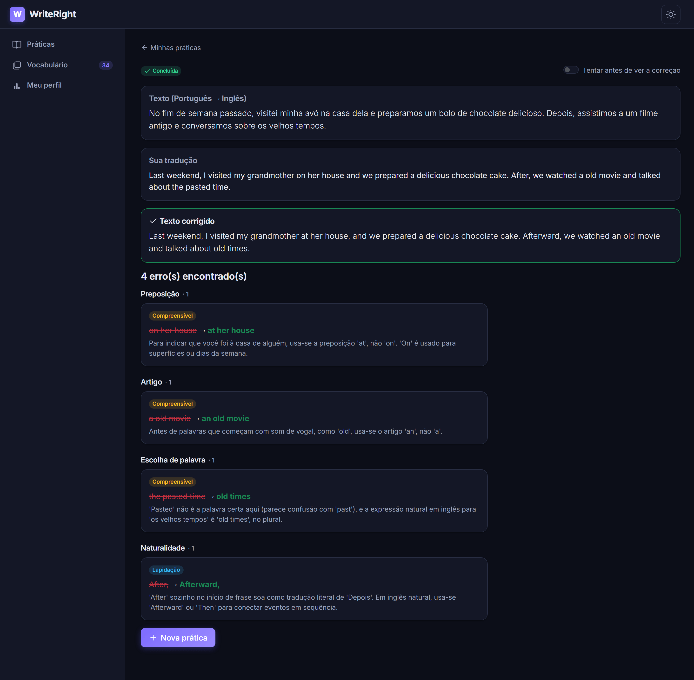
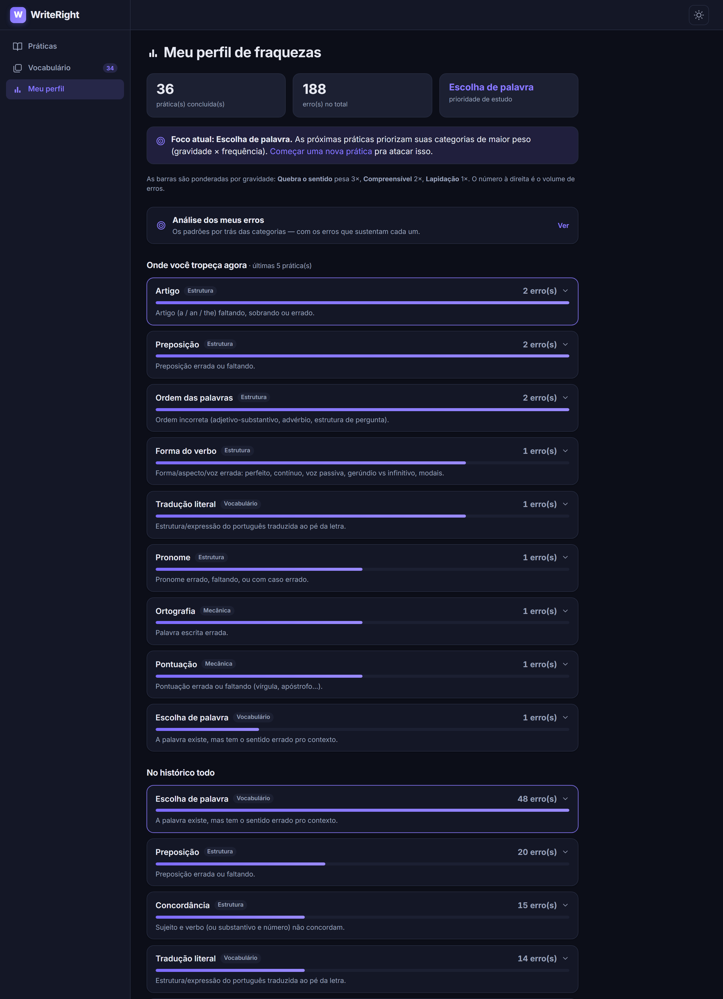
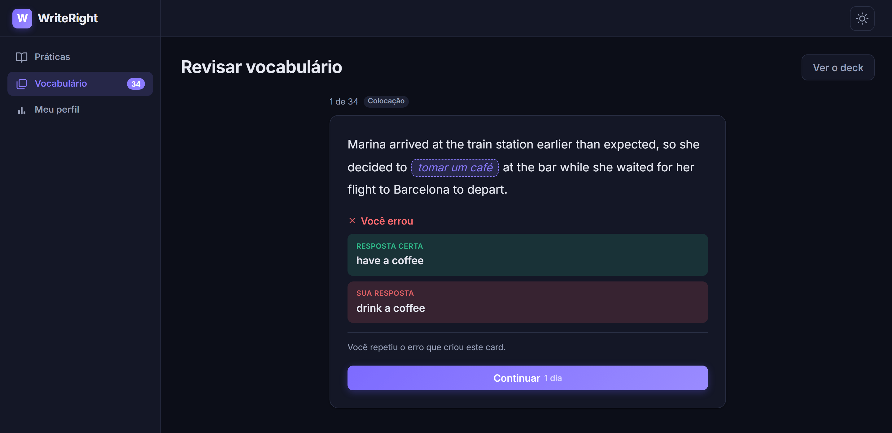
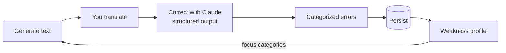
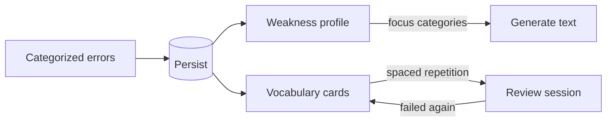

# WriteRight

> AI-powered writing practice: translate texts and get corrections that track your recurring mistakes to focus your studies.


WriteRight is a small app I built to practice writing in another language — and to actually use, not just demo. You translate a short generated text, an LLM corrects it and **classifies every mistake into a fixed taxonomy**, and those classifications pile up into a profile of your weaknesses that then **steers the next exercise** toward the categories you get wrong most.

It's a personal tool first (I use it to study English) and a portfolio piece second.

## Screenshots

**Correction.** Your translation against the corrected text, and every mistake tagged with a category and a severity — grouped by category, not listed as prose.



**Weakness profile.** The same categories aggregated — recent practices next to the whole history — which is what steers the next exercise.



**Vocabulary review.** A card minted from a real mistake: the corrected sentence with the answer blanked out, the source-language phrase as the hint, and — on a miss — what you actually wrote.



## The idea: an adaptive error loop

Most correction tools tell you what's wrong once and forget it. WriteRight remembers. The core is a closed loop — **error → category → profile → targeted generation**:



1. **Generate** a short text at your CEFR level, optionally themed.
2. **Translate** it yourself.
3. **Correct** — the model returns the fixed text plus every error, each tagged with a **category** and a **severity**, via structured output (a JSON schema, not free text).
4. **Persist** every categorized error.
5. **Profile** — aggregate errors by category to surface your top weaknesses.
6. **Target** — the next text is generated so that translating it naturally forces those weak categories to come up again.

The fixed taxonomy is what makes this work: stable categories mean the profile stays comparable over time, and the model is *required* to classify into them rather than inventing labels.

## The taxonomy (the core asset)

A **closed set of 19 categories** — deliberately fixed, because every new category fragments the historical data. Correction and severity are separate axes (severity: *breaks meaning* / *understandable* / *polish*), so you can study what actually blocks communication before the fine details.

| Group | Categories |
|---|---|
| **Structure / grammar** | SubjectOmission, VerbTense, VerbForm, Agreement, Article, Preposition, Pronoun, WordOrder, NumberCountability, MissingOrExtraWord |
| **Vocabulary / meaning** | WordChoice, FalseCognate, Collocation, LiteralTranslation |
| **Mechanics** | Spelling, Capitalization, Punctuation |
| **Style** | Naturalness |
| **Escape hatch** | Other (used only when nothing else fits — a high rate here means a category is missing) |

The taxonomy lives in one place (`WriteRight.Shared`) and is the single source of truth: the UI reads its friendly labels from it, and the JSON schema sent to the model derives its allowed values straight from the same enums — so the schema can never drift out of sync with the taxonomy.

## Weakness analysis: the *why* behind the categories

The profile tells you **what** you get wrong ("Preposition ×12"). It can't tell you that 8 of those 12 are one single rule you never learned, or that three separate categories are really one habit. A closed taxonomy is what makes the data comparable — and it's also what makes it blind to the sub-pattern inside a bucket.

So there's a second, deliberately separate screen that sends your **real error rows** to a stronger model and asks for the structure behind them. Two rules keep it from degrading into generic AI advice:

- **No claim without evidence.** The model receives each error with an id and must cite ids to support every pattern. The server checks them against what it actually sent and drops anything that doesn't ground out — a pattern under the evidence floor never becomes a record. Each pattern renders with the exact errors that produced it. Categories are *derived* from that evidence, never asked for.
- **Error rows only — never your texts.** Not for token cost (that's marginal) but because with the full text in context the model starts producing claims nothing can back: "your sentences are short", "repetitive vocabulary". The diet enforces the first rule structurally: it can't assert what it can't point at. The accepted blind spot is stated on the page.

The analysis window is sized **by error volume, not by practice count** — counting is honest at low N, pattern detection isn't. It walks back from your most recent practices until it has enough material, which self-adjusts as you improve. Results are persisted with a watermark of what they were based on, so the diagnosis stays stable between readings instead of rewording itself on every page load.

## The vocabulary deck: where the category loop can't reach

The adaptive loop works by **category**, and that's the right unit for grammar: a rule generalises. Learn that it's "excited *about*" and the next preposition you meet benefits. Vocabulary doesn't work that way — each lexical item is its own thing.

My own data made this concrete. Of 188 errors across 36 practices, **82 (44%) were vocabulary** — and those 82 had **82 distinct corrections**. Not one repeated on its own, and the ratio has held as the history grew. Generating another text tagged `WordChoice` will never make me meet "colorful façades" again. Category-level targeting is structurally blind here, and no amount of tuning fixes that.

So there's a deck, and it's built from the same source of truth as everything else:



**Cards are minted from real errors, never from a word list.** The front is the corrected sentence with the answer blanked out, plus the corresponding phrase in the *source* language as a hint. The back carries the answer and **what you actually wrote** — your own mistake is the strongest memory hook available, and a generic deck can't have it.

A few decisions worth naming:

- **The cloze is free.** The correction appears verbatim in the corrected text in 81 of 82 real cases, so the blank is cut by string matching — no extra model call, and it works retroactively on history. When the sentence yields nothing usable, **the card isn't minted**: a bad front would be answered wrong forever and poison the scheduler's statistics.
- **No hint, no card either.** The blank alone rarely has a unique answer — "at the ___ center" accepts anything — so a card whose source phrase is missing would be wrong forever, counting lapses and corrupting the very statistics that say whether the scheduler works. The rule is enforced three times over: the minting guard skips it, the field is non-nullable, and the column is `NOT NULL` with a `CHECK` against the empty string. Two unanswerable cards had already been minted before the rule existed.
- **The hint is language-neutral.** It's the phrase in the exercise's *source* language, not "the Portuguese" — EN→PT practices already exist, and source and target swap with the direction. A third language is in play elsewhere in the app (corrections are written in yours), which is exactly why a field named after a language rather than a role eventually names the wrong one.
- **You type the answer.** Self-rating measures the *feeling* of knowing, which is a poor estimate of memory. Typing gives an objective right/wrong, and easy/hard only refines the interval afterwards — the buttons don't even appear on a miss. A near miss (exactly one word wrong, and that word within one edit — two if it's long) is adjudicated by you, not the server.
- **Cards copy their content** — no id, no foreign key, nothing pointing back. Practices can be deleted, and cascade would take months of review history with them. Same snapshot decision as the analysis evidence, taken to its conclusion: a reference that may dangle is worse than no reference at all.
- **Failing the same item again while writing reschedules the existing card** rather than minting a second one — real-world failure is stronger evidence than any button. It deliberately writes no review row: the log answers "coming back after N days, what's the hit rate?", and a failure with no interval attached would corrupt exactly that.
- **The scheduler is boring on purpose.** Plain SM-2. The value of this module is in the card content, not the arithmetic; writing FSRS would be effort spent on the part that's already solved.
- **Minting commits separately from the correction.** If it shared the transaction, a failure while minting would roll the correction back — and that correction has already been paid for. Losing a few cards is the cheaper failure; the errors behind them are still in the profile either way.
- **At most one card per source sentence per session.** A sentence that collected three errors mints three cards, and each one's front spells out the other two's answers. On my real deck that was **39 of 75 cards** — over half a session answering itself. The siblings aren't dropped; they surface once the one ahead leaves the queue. Only real data exposed this: every synthetic test I'd written used one error per sentence.

## Tech stack

- **Backend:** ASP.NET Core minimal API (.NET 10, C#)
- **Frontend:** Blazor WebAssembly (standalone SPA)
- **Data:** EF Core + SQLite (enums persisted as strings; migratable to Postgres later)
- **AI:** Claude via the official Anthropic C# SDK, using **structured output**
- **Tests:** xUnit

Blazor earns its place here for one concrete reason: the API and the UI **share the same C# data contracts** (`WriteRight.Shared`), so there's no parallel TypeScript model to keep in sync.

The AI work is split by cost: a fast, cheap model **generates** exercises and a stronger model **corrects** them — both are configurable.

## Project structure

```
WriteRight.slnx
├── WriteRight.Shared/   # DTOs + the error taxonomy (shared by API and UI)
├── WriteRight.Api/      # Minimal API, EF Core/SQLite, Claude integration
├── WriteRight.Client/   # Blazor WebAssembly SPA
└── WriteRight.Tests/    # xUnit — covers the core (taxonomy, schema, persistence, aggregation)
```

## Running locally

**Prerequisites**

- [.NET 10 SDK](https://dotnet.microsoft.com/download)
- An **Anthropic API key** with pay-as-you-go credit ([console.anthropic.com](https://console.anthropic.com)) — this is billed separately from a Claude.ai subscription.

**Set the API key** (via user-secrets — never commit it):

```bash
dotnet user-secrets set "Llm:ApiKey" "sk-ant-..." --project WriteRight.Api
```

**Run the API and the client** in two terminals (both over HTTP, to avoid mixed-content):

```bash
dotnet run --project WriteRight.Api      # API   → http://localhost:5056
dotnet run --project WriteRight.Client   # SPA   → http://localhost:5193
```

Then open **http://localhost:5193**. The SQLite database is created automatically on first run.

**API endpoints**

| Method | Route | Purpose |
|---|---|---|
| `POST` | `/api/practices` | Create a practice (generates the text, stores it as in-progress) |
| `GET` | `/api/practices` | List practices for the home screen |
| `GET` | `/api/practices/{id}` | Full practice detail (resume or read) |
| `PUT` | `/api/practices/{id}/translation` | Save a draft translation without correcting |
| `POST` | `/api/practices/{id}/correct` | Correct the translation, store the errors, complete the practice |
| `DELETE` | `/api/practices/{id}` | Delete a practice and its errors |
| `GET`  | `/api/profile` | The aggregated weakness profile |
| `GET`  | `/api/profile/errors?category=` | Your real errors in one category (review panel — no AI call) |
| `GET`  | `/api/analysis` | The latest weakness analysis + whether a new one is worth generating |
| `POST` | `/api/analysis` | Generate and persist a new analysis |
| `GET`  | `/api/cards/due` | The review queue — **without** the answers |
| `POST` | `/api/cards/{id}/check` | Grade the typed answer and reveal (schedules nothing) |
| `POST` | `/api/cards/{id}/review` | Close the review: reschedule the card and log it |
| `GET`  | `/api/cards` | The whole deck (counters + cards) |
| `DELETE` | `/api/cards/{id}` | Discard a bad card (marks, never deletes) |
| `GET`  | `/api/usage` | Token/cost report per operation, and the average cost of a practice (no AI call) |

## Configuration

Under the `Llm` section (user-secrets or `appsettings`):

| Key | Default | Purpose |
|---|---|---|
| `Llm:ApiKey` | — | Anthropic API key (**required**) |
| `Llm:GenerationModel` | `claude-haiku-4-5` | Model that generates exercises |
| `Llm:CorrectionModel` | `claude-sonnet-5` | Model that corrects translations |
| `Llm:AnalysisModel` | `claude-sonnet-5` | Model that analyses the error history |
| `Llm:Pricing:<model>` | **required** | USD per MTok for that model — see below |

The vocabulary deck adds no configuration and makes no AI calls of its own — the content of every card was already paid for by the correction that produced it.

**Pricing.** The API returns token counts, never a monetary cost, so turning tokens into dollars is always the client's job. The rates live in `appsettings.json` and **only** there — there is no built-in table in code, because a price that exists in two places just raises the question of which one is winning:

```json
"Llm": {
  "Pricing": {
    "claude-haiku-4-5": { "InputPerMTok": 1.00, "OutputPerMTok": 5.00 },
    "claude-sonnet-5":  { "InputPerMTok": 3.00, "OutputPerMTok": 15.00 }
  }
}
```

Since there is no fallback, **every model in use must be priced** — switching `Llm:CorrectionModel` to a model with no rate fails at startup, naming the model and the line to add. Forgetting a price would otherwise break nothing visible: the app would run, practices would work, and only the cost report would come back empty. A negative rate is rejected the same way; zero is allowed, since it states outright that the model is free.

A response that arrives from an unexpected model (an alias resolving to another snapshot) is still recorded with its token counts and a **null** cost, surfacing as `unpricedCalls` in `/api/usage` rather than silently counting as zero.

## Tests

```bash
dotnet test
```

The suite covers the parts with real logic and real regression risk:

- **Taxonomy** — every category has metadata; the catalog and the enum stay in sync.
- **Structured-output schema** — the JSON schema lists every category and severity, so it can't drift from the taxonomy.
- **Wire contract** — the JSON Claude returns deserializes into the right enums, using the exact same serializer options as production; every category round-trips as a string (the contract that keeps the DB, API and client aligned).
- **Adaptive generation** — the prompt injects focus categories when there are weaknesses, and doesn't when there aren't.
- **Persistence + aggregation** — correcting stores the attempt and its errors, and the profile aggregates by category ordered by frequency, tested against a **real in-memory SQLite** database (so the enum-as-string value converters run for real).
- **Evidence grounding** — the analysis drops any pattern that cites error ids it was never sent or that falls under the evidence floor, and persists nothing when none survive. The window sizing (by error volume, not practice count) and the snapshotting of evidence — an analysis stays intact even after the practice it cited is deleted — are covered too.
- **The deck** — mostly the failure paths, because they're the ones that quietly corrupt data: an unusable sentence mints no card, a recurring error reschedules instead of duplicating (and writes no review row), a discarded card is never resurrected, a card outlives the practice that created it, and siblings from one sentence never share a session. Plus the interval arithmetic, where a wrong sign breaks nothing visible — it just makes reviews arrive at the wrong time for months.

**Conscious gap:** the real HTTP call to Anthropic isn't tested — it costs money and is flaky. The model sits behind an interface and is swapped for a fake in tests, so everything *around* the call is covered. New logic ships with tests, and the suite runs on every change.

## Status

The loop works end to end: generate → translate → correct → profile → review. The UI is functional but intentionally plain — I'm refining it. This is a personal project I use to study, kept clean because the repo is public; it isn't aiming for monetization.

**Not measured yet:** whether the scheduler's intervals are any good. The review log records the interval a card was shown at and whether it was hit, which is what makes the question answerable — but it needs months of reviews before the answer means anything, and there's no screen for it yet.

## License

[MIT](LICENSE) © 2026 André Augusto Boniatti
